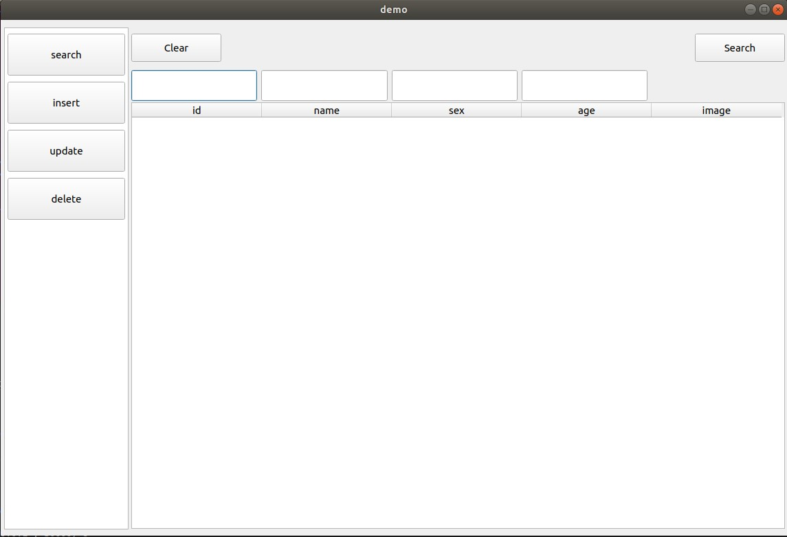
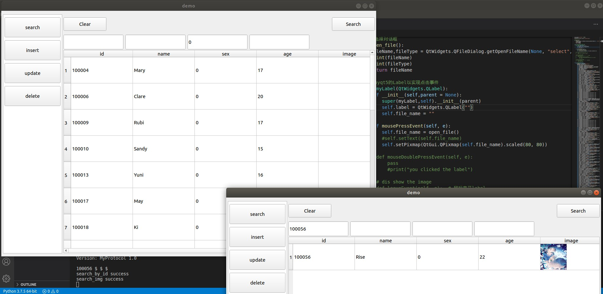
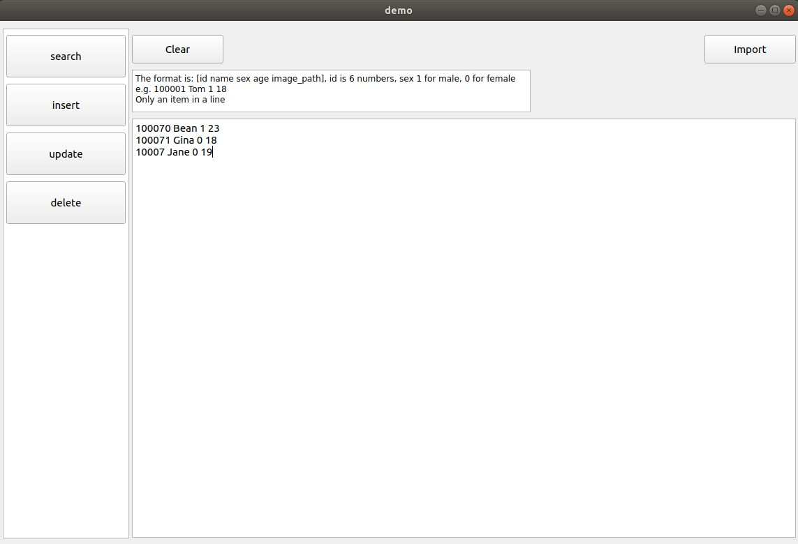
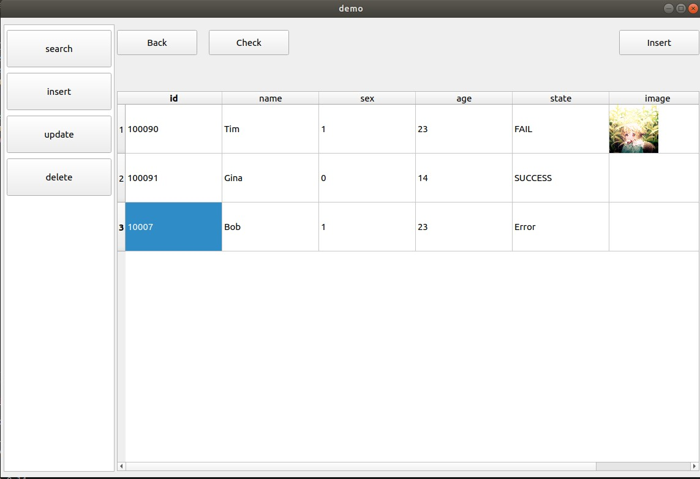
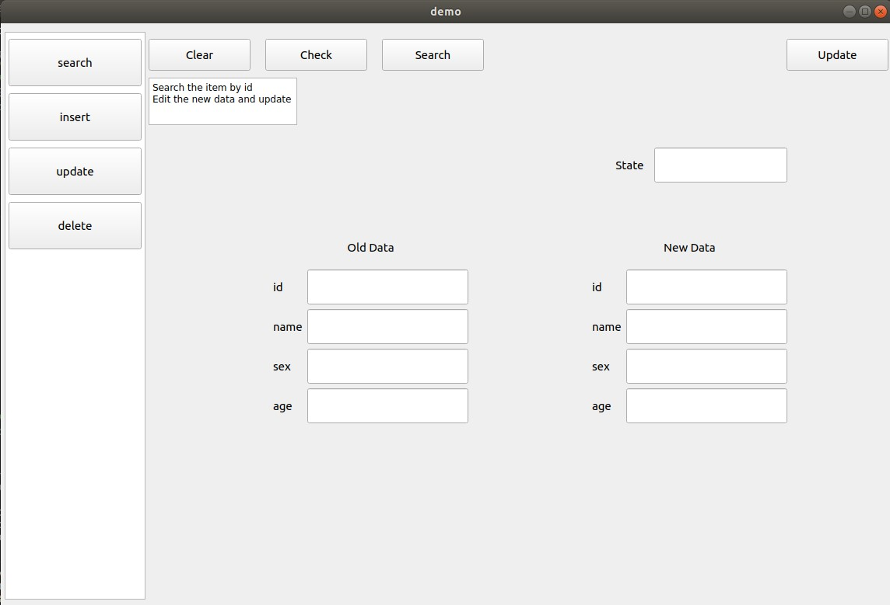
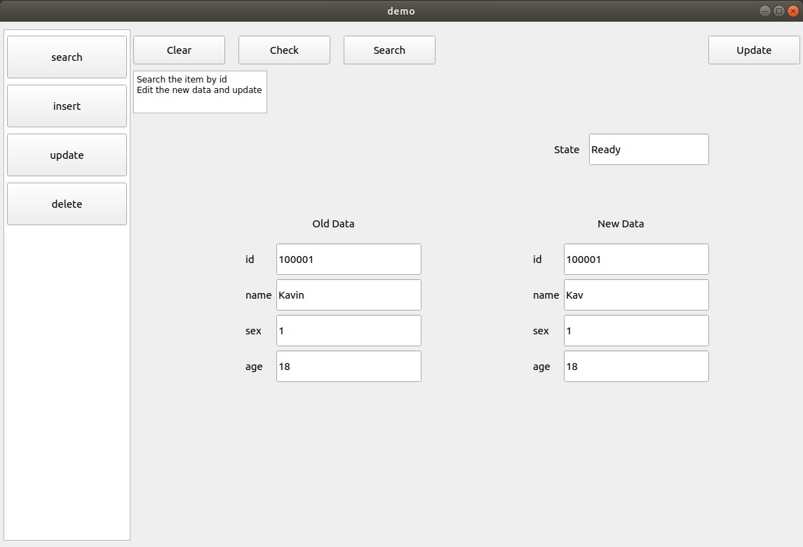
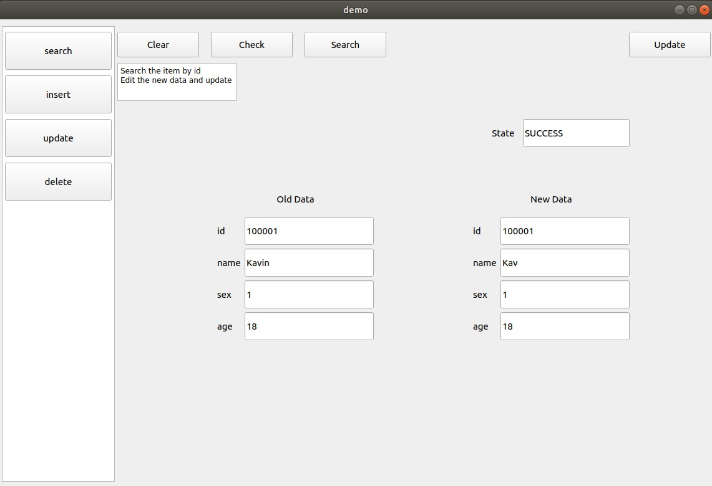
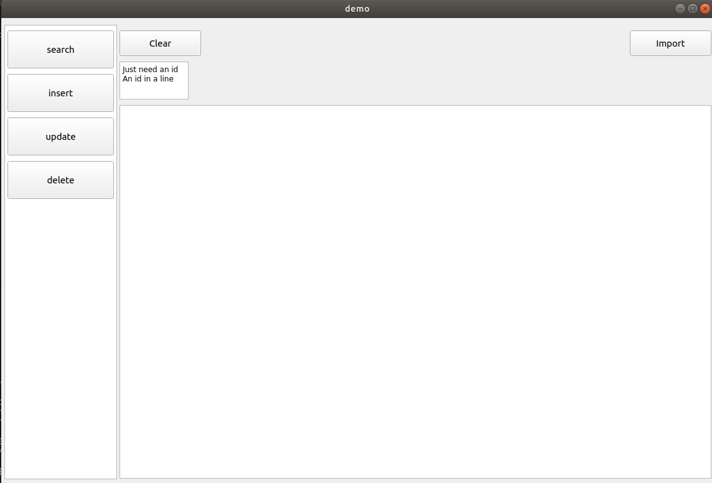
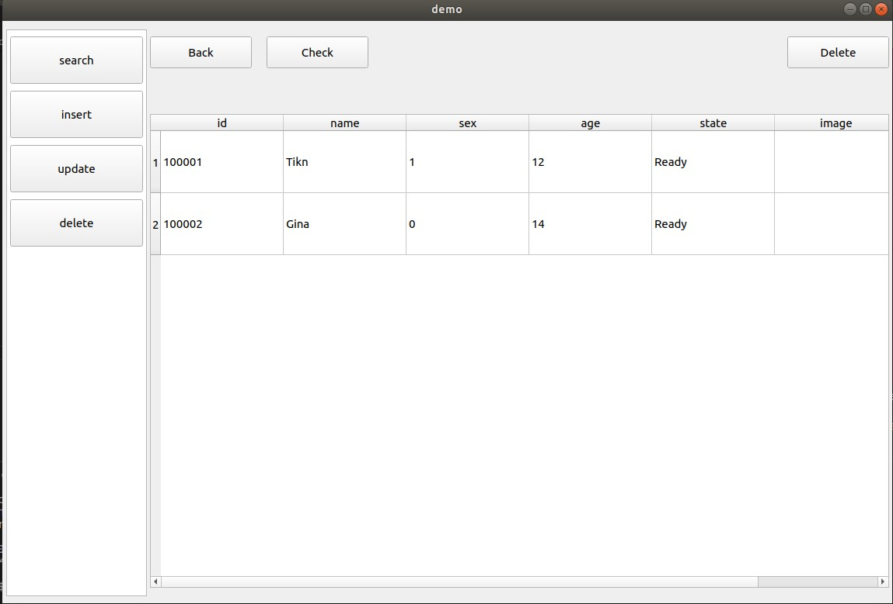

# Socket-Lab

Socket编程lab

开发环境 `python 3.7`

第三方库 `pyqt5, pymysql`

## 运行

`python server.py`启动服务端

`python client.py`运行客户端

## 数据库设计

两个表分别存储文本和图片信息

| id     | name | sex  | age  |
| ------ | ---- | ---- | ---- |
| 100001 | Tom  | 1    | 18   |

| id     | image_path                           |
| ------ | ------------------------------------ |
| 100001 | /home/misaki/Pictures/100001_Tom.png |

- `id`为6位`int`，且为主码
  - 第二个表的`id`为外码，参照第一个表的`id`
- `name`无格式限制
- `sex`为`0`或`1`
- `age`为2位`int`
- `image_path`无格式限制

## GUI

GUI基于PyQt5开发

### search功能

目前只支持使用单个信息搜索，同时输入多个信息查询时无法得到结果

只有使用`id`查询时才能得到图片信息

## insert功能

侧栏`insert`进入数据导入界面，输入格式为`id name sex age path(可选)`，一行一个数据，以空格符分隔

`Import`导入数据，进入数据编辑界面

导入数据时会检查输入的数据是否符合数据库设计要求，`state`显示为`Ready`或`Error`

点击表格修改数据，点击`Check`按钮检查数据是否符合要求并更新`state`状态

点击表格`image`框选择上传图片文件，图片路径也可以在数据导入界面直接输入

`insert`向服务器发送数据，`state`为`Ready`的条目会根据服务器发回的信息更新`state`和`image`的状态，若成功则更新为`SUCCESS`，否则为`FAIL`

`state`为`Error`的条目不会发送给服务器

服务器的文本和图片的处理是分开的，传输图片出错不影响文本信息的插入，即可能出现文本成功但图片失败的情况

## update功能

`Old Data`中输入`id`后点击`Search`查询

`Old Data`中其他信息不可编辑

查询后在`New Data`中修改信息，其中`id`无法修改

`Check`按钮检查`New Data`数据是否符合数据库设计要求，并在`State`中显示状态，`State`为`Error`的数据不会发送给服务器

`Update`向服务器发送数据，并在`State`窗口显示状态：`SUCCESS`或`FAIL`

## delete功能

侧栏`insert`进入数据导入界面，数据格式和`insert`的数据导入界面一样，只需要输入一个`id`即可，其余信息虽然会导入但是不会发送给服务器

导入数据后的界面和`insert`相同，但此时`Check`只会检查`id`是否符合要求

`Delete`只会发送`id`信息给服务器而忽略其他信息

根据服务器发回的信息更新`State`和的状态，但此时不会单独更新`image`的状态，两者统一到`state`中显示

